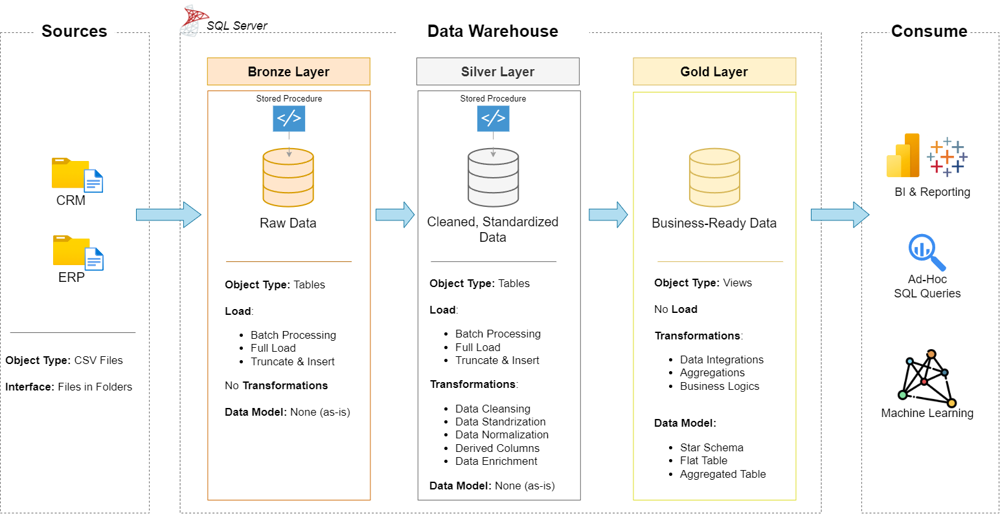
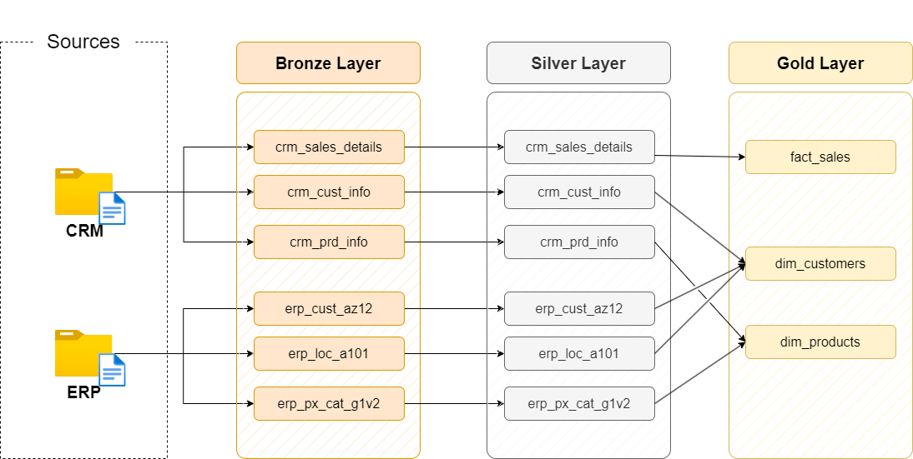
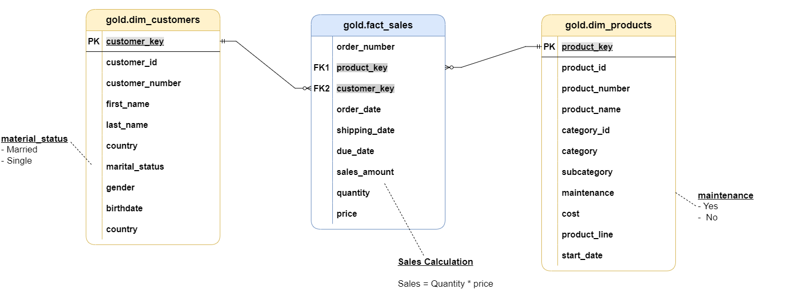

# Data Warehouse and Analytics Project

Welcome to the **Data Warehouse and Analytics Project** repository! 🚀  
This project demonstrates a comprehensive data warehousing and analytics solution, from building a data warehouse to generating actionable insights. Designed as a portfolio project, it highlights industry best practices in data engineering and analytics.

---
## 🏗️ Data Architecture & Layers

The data architecture for this project follows Medallion Architecture **Bronze**, **Silver**, and **Gold** layers:

1. **Bronze Layer**: Stores raw data as-is from the source systems. Data is ingested from CSV Files into SQL Server Database.
2. **Silver Layer**: This layer includes data cleansing, standardization, and normalization processes to prepare data for analysis.
3. **Gold Layer**: Houses business-ready data modeled into a star schema required for reporting and analytics.

---
### Data Flow Diagram:

---
## 📊 Data Modeling (Star Schema)

The final business-ready data in the Gold layer is structured into a optimized Star Schema for high-performance analytical querying:

---
## 📖 Project Overview

This project involves:
1. **Data Architecture**: Designing a Modern Data Warehouse Using Medallion Architecture.
2. **ETL Pipelines**: Extracting, transforming, and loading data from source systems into the warehouse.
3. **Data Modeling**: Developing fact and dimension tables optimized for analytical queries.
4. **Analytics & Reporting**: Creating SQL-based reports and dashboards for actionable insights.

---
## 🛠️ Important Tools & Environment

- **Datasets:** Source project datasets stored as CSV files.
- **SQL Server Express:** Lightweight server used for hosting the relational SQL database.
- **SQL Server Management Studio (SSMS):** GUI for managing, querying, and interacting with databases.
- **DrawIO:** Used to design data architecture diagrams, star schemas, and data flows.

---
## 🚀 Project Requirements

### Building the Data Warehouse (Data Engineering)
- **Data Sources**: Import data from two source systems (ERP and CRM) provided as CSV files.
- **Data Quality**: Cleanse and resolve data quality issues prior to analysis.
- **Integration**: Combine both sources into a single, user-friendly data model designed for analytical queries.
- **Scope**: Focus on the latest dataset only; historization of data is not required.

### BI: Analytics & Reporting (Data Analysis)
Develop SQL-based analytics to deliver detailed insights into:
- **Customer Behavior**
- **Product Performance**
- **Sales Trends**

